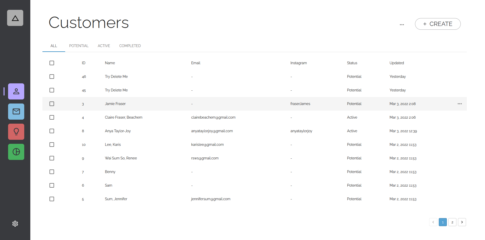
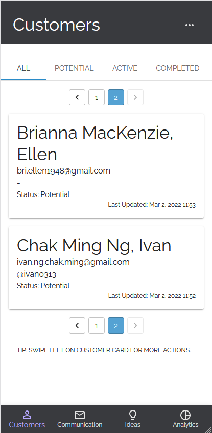

# Artist CRM

See Live: https://artist-crm.ivan0313.tk

Front-end for https://github.com/ivan-ngchakming/artist-crm-api

## Features

1. Customer database CRUD operations with pagination ([Completed](https://artist-crm.ivan0313.tk/#/customers))

2. Email viewer and editor ([In-progress](https://artist-crm.ivan0313.tk/#/communications))

## Screens

UI designs are first created on Figma, then implemented following the design.

<https://www.figma.com/file/KYg3VhSpc8laNqK75Txdc8/Artist-CRM-Design?node-id=0%3A1>





## Project setup

.env

```bash
REACT_APP_BASE_URL=https://artist-crm-api.herokuapp.com
```
